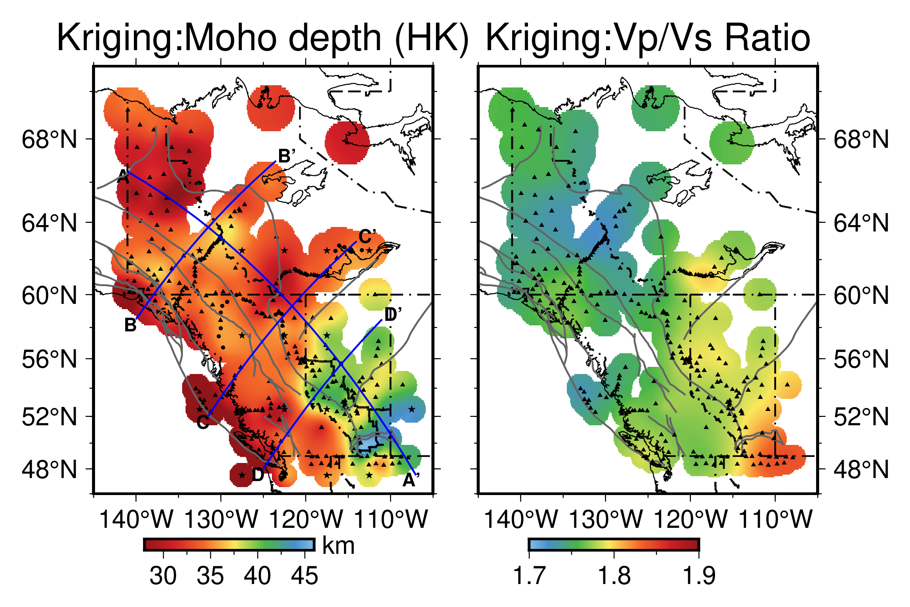

**WCANM22**
======

## Description

We present a new model of Moho depth and Vp/Vs in western Canada (i.e., *WCANM22*) by integrating existing seismic constraints from active source experiments (e.g., Lithoprobe) and new measurements from passive teleseismic data (i.e., receiver functions). Crustal properties determined from various data types are reconciled by considering the spatial coherence between sampling points using the kriging interpolation. 

## Reference
Zhang et al., 2024, A reference model of crustal thickness and Vp/Vs of Western Canada, in preparation. 

BibTeX:

	@article{zhang2024A,
	  title={A reference model of crustal thickness and Vp/Vs of Western Canada},
	  author={Quan Zhang et al.},
	  journal={TBD},
	  volume={TBD},
	  number={TBD},
	  pages={TBS},
	  year={2024}
	}

-----------
## Copyright
    The WCANM22 research team, 2021-present
-----------

## License
    GNU General Public License, Version 3
    (http://www.gnu.org/copyleft/gpl.html)  
    
-----------
## Development
    The development team welcomes voluntary contributions from any open-source enthusiast. 
    If you want to make contribution to this project, feel free to contact the development team. 

-----------
## Contact
    Regarding any questions, bugs, developments, collaborations, please contact  
    Quan Zhang
    quanzhang1997@gmail.com

	Figure 1. Western Canada Crustal Model.

